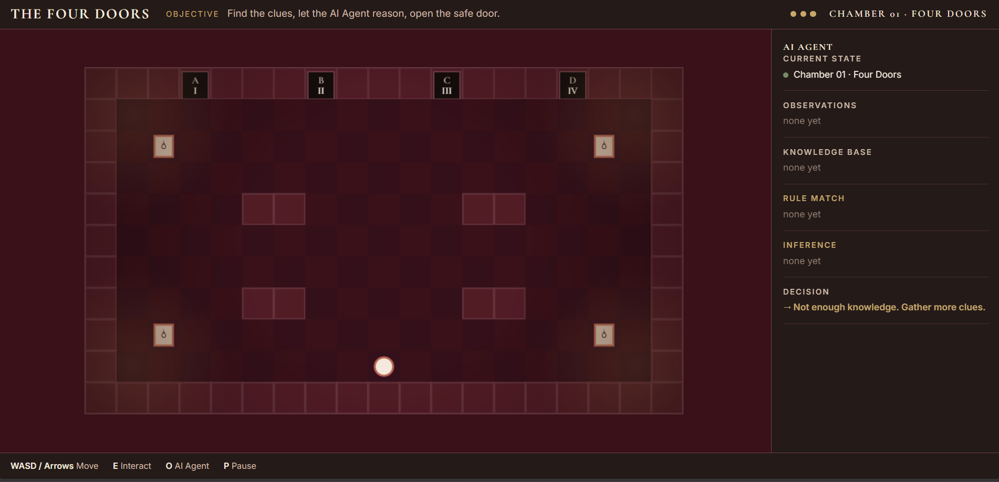
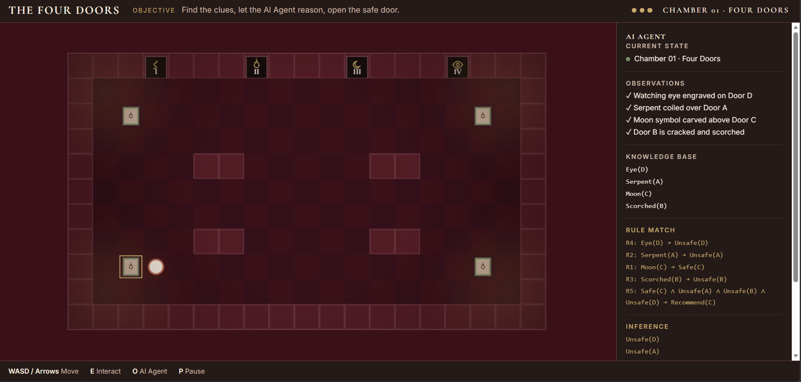
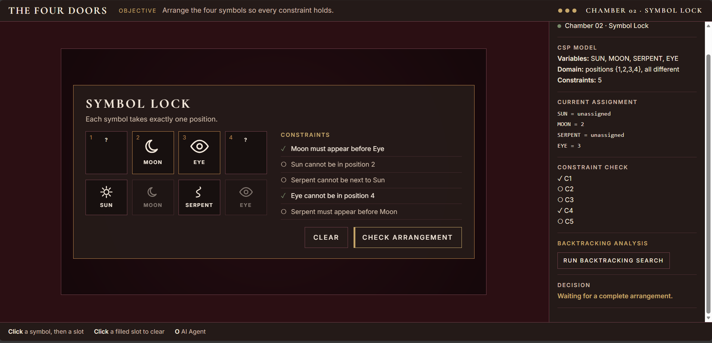
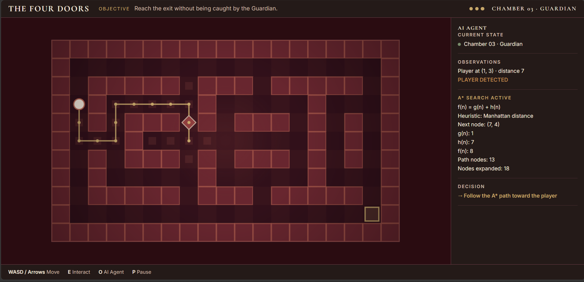
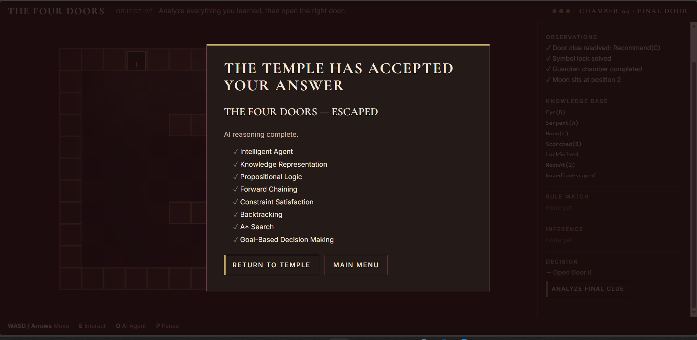

# 🏛️ THE FOUR DOORS

### An AI Escape & Reasoning Game

<p align="center">
  <strong>
    An interactive 2D escape game demonstrating Symbolic Artificial Intelligence
    through Intelligent Agents, Logical Inference, Constraint Satisfaction,
    Backtracking, and A* Search.
  </strong>
</p>

<p align="center">
  <a href="https://vipin280720081157-08.github.io/the-four-doors/">
    
  </a>
</p>

<p align="center">
  
  
  
  
  
</p>

---

## 🎮 Live Demo

<p align="center">

### ▶️ [PLAY THE FOUR DOORS](https://vipin280720081157-08.github.io/the-four-doors/)

</p>

The complete game runs directly in the browser.

**No installation. No backend. No external API. No machine learning.**

The game demonstrates how an AI Agent can observe an environment, build knowledge, perform logical inference, solve constraints, search for paths, and make goal-based decisions.

---

# 📖 Overview

**The Four Doors** is an AI-based escape and reasoning game set inside a connected four-chamber temple.

The player explores the environment, discovers clues, solves reasoning challenges, avoids an AI Guardian, and ultimately escapes the temple.

At the center of the game is an **AI Agent** that processes observations and uses different Artificial Intelligence techniques to determine actions and decisions.

The project demonstrates:

- Intelligent Agents
- Agent–Environment Interaction
- Knowledge Representation
- Propositional Logic
- Forward Chaining
- Constraint Satisfaction Problems
- Backtracking
- Heuristic Search
- A* Search
- Goal-Based Decision Making

The project intentionally focuses on **Symbolic AI and classical AI algorithms rather than Machine Learning or Deep Learning**.

---

# 🧠 AI Concepts Demonstrated

| AI Concept | How It Is Used |
|---|---|
| 🤖 **Intelligent Agent** | The AI Agent observes the temple environment and makes decisions |
| 🌐 **Agent–Environment Interaction** | The agent receives observations and produces actions/decisions |
| 📚 **Knowledge Representation** | Game observations are stored as structured facts |
| 🔣 **Propositional Logic** | Facts and logical rules determine safe and unsafe doors |
| 🔁 **Forward Chaining** | New conclusions are derived from known facts and rules |
| 🧩 **Constraint Satisfaction** | The Symbol Lock is modeled as a CSP |
| ↩️ **Backtracking** | Invalid symbol assignments are rejected and alternative assignments are explored |
| 🧭 **Heuristic Search** | The Guardian uses a heuristic to guide pathfinding |
| ⭐ **A* Search** | The Guardian calculates an efficient path toward the player |
| 🎯 **Goal-Based Decision Making** | The AI uses accumulated information to reach the final escape goal |

---

# 🏛️ Game Structure

The temple contains **four connected chambers**, with each chamber demonstrating a different AI concept.

```text
                 ┌──────────────────────┐
                 │     THE FOUR DOORS   │
                 │      AI AGENT GAME   │
                 └──────────┬───────────┘
                            │
                            ▼
              ┌─────────────────────────┐
              │  CHAMBER 01             │
              │  FOUR DOORS             │
              │                         │
              │  Knowledge Base         │
              │  Propositional Logic    │
              │  Forward Chaining       │
              └────────────┬────────────┘
                           │
                           ▼
              ┌─────────────────────────┐
              │  CHAMBER 02             │
              │  SYMBOL LOCK            │
              │                         │
              │  CSP                    │
              │  Backtracking            │
              └────────────┬────────────┘
                           │
                           ▼
              ┌─────────────────────────┐
              │  CHAMBER 03             │
              │  GUARDIAN               │
              │                         │
              │  Heuristic Search       │
              │  A* Search              │
              └────────────┬────────────┘
                           │
                           ▼
              ┌─────────────────────────┐
              │  CHAMBER 04             │
              │  FINAL DOOR             │
              │                         │
              │  Goal-Based Decision    │
              │  Final Inference        │
              └────────────┬────────────┘
                           │
                           ▼
                    🏆 ESCAPE
````

---

# 🤖 AI Agent Architecture

The game follows an agent–environment interaction model.

```text
┌──────────────┐
│    PLAYER    │
└──────┬───────┘
       │
       ▼
┌──────────────────────┐
│ TEMPLE ENVIRONMENT   │
└──────────┬───────────┘
           │
           ▼
┌──────────────────────┐
│     OBSERVATION      │
└──────────┬───────────┘
           │
           ▼
┌──────────────────────┐
│      AI AGENT        │
└──────────┬───────────┘
           │
     ┌─────┼───────────────┐
     │     │               │
     ▼     ▼               ▼
┌────────┐ ┌────────────┐ ┌────────────┐
│Knowledge│ │    CSP +   │ │  A* Search │
│& Logic │ │ Backtracking│ │            │
└────┬───┘ └──────┬─────┘ └──────┬─────┘
     │            │              │
     └────────────┼──────────────┘
                  ▼
        ┌──────────────────┐
        │    AI DECISION   │
        └────────┬─────────┘
                 │
                 ▼
        ┌──────────────────┐
        │    GAME ACTION   │
        └────────┬─────────┘
                 │
                 ▼
        ┌──────────────────┐
        │ UPDATED WORLD    │
        └──────────────────┘
```

The **AI Agent panel** exposes the reasoning state so that the player can observe how the AI processes information.

---

# 🚪 Chamber 01 — Four Doors

### AI Techniques

* Knowledge Representation
* Propositional Logic
* Forward Chaining
* Goal-Based Decision Making

The player discovers clues associated with four doors.

The observations are converted into facts such as:

```text
Moon(C)
Serpent(A)
Eye(D)
Scorched(B)
```

These facts are stored in the Knowledge Base.

The AI Agent then evaluates logical rules such as:

```text
Moon(C) → Safe(C)

Serpent(A) → Unsafe(A)

Eye(D) → Unsafe(D)

Scorched(B) → Unsafe(B)
```

A final rule determines the recommended door when the required conditions are satisfied:

```text
Safe(C)
∧ Unsafe(A)
∧ Unsafe(B)
∧ Unsafe(D)
→ Recommend(C)
```

The reasoning process uses **forward chaining**, repeatedly applying matching rules until no new facts can be derived.

---

# 🧩 Chamber 02 — Symbol Lock

### AI Techniques

* Constraint Satisfaction Problem
* Backtracking Search

The player must arrange four symbols while satisfying all constraints.

### Variables

```text
SUN
MOON
SERPENT
EYE
```

### Domain

```text
Positions = {1, 2, 3, 4}
```

All symbols must occupy different positions.

### Constraints

```text
C1: Moon must appear before Eye

C2: Sun cannot be in position 2

C3: Serpent cannot be next to Sun

C4: Eye cannot be in position 4

C5: Serpent must appear before Moon
```

The solver assigns symbols one at a time.

When an assignment violates a constraint, the algorithm backtracks and tries another possibility.

The puzzle has exactly one valid solution:

```text
SERPENT → MOON → EYE → SUN
```

---

# 🧭 Chamber 03 — Guardian

### AI Techniques

* Heuristic Search
* A* Search
* Manhattan Distance

The Guardian navigates the temple grid using **A* search**.

The evaluation function is:

```text
f(n) = g(n) + h(n)
```

Where:

```text
g(n) = cost from the starting node to node n

h(n) = estimated cost from node n to the goal
```

The heuristic used by the Guardian is **Manhattan distance**:

```text
h(n) = |x₁ - x₂| + |y₁ - y₂|
```

When the player is detected within the required range, the Guardian calculates a path toward the player's position.

The computed path is visualized in the game using the highlighted path.

---

# 🔐 Chamber 04 — Final Door

The final chamber combines the information collected during the previous stages.

The AI Agent carries forward information such as:

```text
Door clue resolved
Symbol lock solved
Guardian chamber completed
Symbol arrangement determined
```

The final decision is based on the accumulated knowledge and the goal of escaping the temple.

This demonstrates **goal-based decision making** using information gathered across the game.

---

# 🔄 Complete Game Flow

```text
        START
          │
          ▼
   Explore Temple
          │
          ▼
   Discover Clues
          │
          ▼
   Build Knowledge Base
          │
          ▼
   Forward Chaining
          │
          ▼
   Select Safe Door
          │
          ▼
     Symbol Lock
          │
          ▼
   CSP + Backtracking
          │
          ▼
      Guardian
          │
          ▼
       A* Search
          │
          ▼
    Reach the Exit
          │
          ▼
      Final Door
          │
          ▼
  Goal-Based Decision
          │
          ▼
       🏆 ESCAPE
```

---

# 🎮 Controls

| Key / Input           | Action                                  |
| --------------------- | --------------------------------------- |
| `W` / `A` / `S` / `D` | Move                                    |
| `Arrow Keys`          | Move                                    |
| `E`                   | Interact                                |
| `O`                   | Show / Hide AI Agent                    |
| `P`                   | Pause                                   |
| `Esc`                 | Pause                                   |
| **Mouse**             | Select symbols and slots in Symbol Lock |

---

# 📸 Screenshots

The following screenshots document the major AI-driven states of the game.

## 01 — Main Game Screen

<p align="center">
  
</p>

**Figure 1 — Main Game Screen**

The opening temple environment showing the player, four doors, game status, and the AI Agent interface.

---

## 02 — AI Agent Reasoning Panel

<p align="center">
  
</p>

**Figure 2 — AI Agent Reasoning Panel**

The AI Agent displays observations, knowledge-base facts, matched rules, logical inferences, and the resulting decision.

---

## 03 — Symbol Lock Puzzle

<p align="center">
  
</p>

**Figure 3 — Symbol Lock Puzzle**

The CSP chamber showing variables, domains, constraints, assignments, and the backtracking search interface.

---

## 04 — Guardian Pathfinding

<p align="center">
  
</p>

**Figure 4 — Guardian Pathfinding using A* Search**

The Guardian calculates a path toward the player using A* search and the Manhattan-distance heuristic.

---

## 05 — Final Door

<p align="center">
  
</p>

**Figure 5 — Final Door — Successful Completion**

The completed temple escape and final AI reasoning state.

---

# 🧮 AI Reasoning Pipeline

The logical reasoning process can be summarized as:

```text
┌──────────────────────┐
│  CLUE / OBSERVATION  │
└──────────┬───────────┘
           ▼
┌──────────────────────┐
│   KNOWLEDGE BASE     │
└──────────┬───────────┘
           ▼
┌──────────────────────┐
│ PROPOSITIONAL RULES  │
└──────────┬───────────┘
           ▼
┌──────────────────────┐
│  FORWARD CHAINING    │
└──────────┬───────────┘
           ▼
┌──────────────────────┐
│ INFERENCE / CONCLUSION│
└──────────┬───────────┘
           ▼
┌──────────────────────┐
│   AI AGENT DECISION  │
└──────────────────────┘
```

This makes the AI reasoning process visible rather than hiding it inside the game engine.

---

# 📁 Project Structure

```text
the-four-doors/
│
├── index.html
├── README.md
│
├── .github/
│   └── workflows/
│       └── deploy.yml
│
├── docs/
│   ├── 01_main_game_screen.png
│   ├── 02_ai_agent_reasoning.png
│   ├── 03_symbol_lock.png
│   ├── 04_guardian_pathfinding.png
│   └── 05_final_door.png
│
└── src/
    ├── main.js
    │
    ├── ai/
    │   └── kb.js
    │
    ├── csp/
    │   └── symbolLock.js
    │
    ├── pathfinding/
    │   └── astar.js
    │
    └── ui/
        └── style.css
```

### Important Modules

| File                           | Responsibility                                     |
| ------------------------------ | -------------------------------------------------- |
| `src/main.js`                  | Game engine, game state, interaction and UI        |
| `src/ai/kb.js`                 | Knowledge Base, logical rules and forward chaining |
| `src/csp/symbolLock.js`        | CSP model and backtracking solver                  |
| `src/pathfinding/astar.js`     | A* pathfinding and Manhattan heuristic             |
| `src/ui/style.css`             | Game interface and Dark Editorial Temple theme     |
| `.github/workflows/deploy.yml` | GitHub Pages deployment workflow                   |

---

# 🛠️ Technology

```text
Frontend
├── HTML5
├── CSS3
└── JavaScript ES6+

AI
├── Knowledge Representation
├── Propositional Logic
├── Forward Chaining
├── Constraint Satisfaction
├── Backtracking
├── Heuristic Search
└── A* Search

Deployment
└── GitHub Pages + GitHub Actions
```

The game runs completely on the client side.

There is:

* ❌ No Machine Learning
* ❌ No Deep Learning
* ❌ No Backend
* ❌ No Database
* ❌ No External AI API

---

# 💻 Run Locally

The project can be opened directly through:

```text
index.html
```

For a local development server, use:

```bash
python -m http.server
```

Then open:

```text
http://localhost:8000
```

Web fonts require an internet connection. If unavailable, the browser falls back to built-in serif and sans-serif fonts.

---

# 🌐 GitHub Pages Deployment

The project is deployed using **GitHub Actions**.

Deployment workflow:

```text
Git Push
   │
   ▼
GitHub Actions
   │
   ▼
Build / Package Static Files
   │
   ▼
GitHub Pages
   │
   ▼
Live Game
```

### Live Website

🔗 **[https://vipin280720081157-08.github.io/the-four-doors/](https://vipin280720081157-08.github.io/the-four-doors/)**

### Deployment Configuration

In the repository:

```text
Settings
   ↓
Pages
   ↓
Build and deployment
   ↓
Source: GitHub Actions
```

The deployment workflow is located at:

```text
.github/workflows/deploy.yml
```

---

# 🎯 Project Objective

The primary objective of **The Four Doors** is to demonstrate classical Artificial Intelligence concepts through an interactive environment.

Instead of presenting AI algorithms only as theoretical implementations, the project places them inside a connected game where the player can observe:

```text
Observation
     ↓
Knowledge
     ↓
Reasoning
     ↓
Search / Constraint Solving
     ↓
Decision
     ↓
Action
```

This provides an interactive demonstration of how an intelligent agent can operate within an environment.

---

# 🏆 Key Outcomes

The project demonstrates:

* ✅ Interactive AI Agent and environment interaction
* ✅ Knowledge representation using structured facts
* ✅ Propositional logical reasoning
* ✅ Forward-chaining inference
* ✅ Constraint satisfaction
* ✅ Backtracking search
* ✅ Heuristic search
* ✅ A* pathfinding
* ✅ Manhattan-distance heuristic
* ✅ Goal-based decision making
* ✅ Visual representation of AI decisions
* ✅ A complete browser-based interactive game
* ✅ Static deployment through GitHub Pages

---

# 📚 Academic Relevance

**The Four Doors** provides an interactive implementation of classical AI topics through one connected problem environment.

| Academic Topic                | Game Implementation                  |
| ----------------------------- | ------------------------------------ |
| Intelligent Agents            | AI Agent interacting with the temple |
| Agent–Environment Interaction | Observations and game actions        |
| Knowledge Representation      | Knowledge Base                       |
| Propositional Logic           | Door safety rules                    |
| Forward Chaining              | Logical inference                    |
| CSP                           | Symbol Lock                          |
| Backtracking                  | Symbol arrangement solver            |
| Heuristic Search              | Guardian navigation                  |
| A* Search                     | Guardian pathfinding                 |
| Goal-Based Decision Making    | Final escape decision                |

---

# 👤 Project

**The Four Doors**

*An AI Escape & Reasoning Game*

Built as an Artificial Intelligence laboratory mini-project demonstrating classical AI concepts through an interactive game environment.

---

<p align="center">

### 🏛️ Enter the Temple.

### 🧠 Discover the Knowledge.

### 🔎 Solve the Reasoning.

### ⭐ Find the Path.

### 🚪 Escape.

<br>

**[🎮 PLAY THE LIVE GAME](https://vipin280720081157-08.github.io/the-four-doors/)**

</p>

---

<p align="center">
  <sub>Built with HTML, CSS, JavaScript and Classical Artificial Intelligence.</sub>
</p>
```